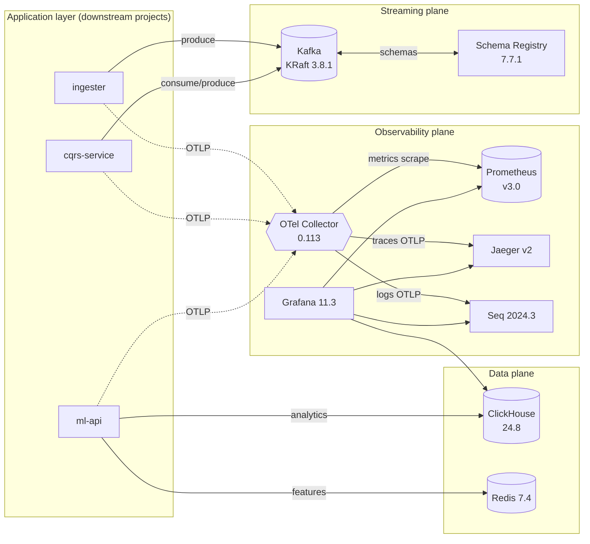

# Architecture

## Container topology

## Network

- Single bridge network `nexus`. All inter-service traffic stays inside it.
- Host-exposed ports bind to `127.0.0.1` only.
- DNS inside the network uses the Compose service name (`kafka`, `clickhouse`, …).

## Volumes & retention

| Volume                  | Mounted at                              | Retention policy (dev default)            |
| ----------------------- | --------------------------------------- | ----------------------------------------- |
| `nexus-kafka-data`      | `/var/lib/kafka/data`                   | Unbounded; wipe via `make nuke`           |
| `nexus-clickhouse-data` | `/var/lib/clickhouse`                   | TTL = 30 d on `nexus.events` (see SQL init) |
| `nexus-clickhouse-logs` | `/var/log/clickhouse-server`            | Container-level rotation                   |
| `nexus-redis-data`      | `/data`                                 | AOF append-only; no TTL                   |
| `nexus-prometheus-data` | `/prometheus`                           | 15 d (`--storage.tsdb.retention.time`)    |
| `nexus-grafana-data`    | `/var/lib/grafana`                      | Dashboards are source-controlled; state is disposable |
| `nexus-jaeger-data`     | `/badger`                               | Badger store, no TTL by default           |
| `nexus-seq-data`        | `/data`                                 | Seq retention policies configured in UI   |

## Start-up ordering

`depends_on: { condition: service_healthy }` is used rather than bare `depends_on`, so:

- `schema-registry` waits for Kafka's broker API to respond.
- `otel-collector` waits for Jaeger and Seq to be started.
- `grafana` waits for Prometheus to be healthy.

Docker Compose v2 respects these conditions; start-up is deterministic.

## Security posture (local dev)

- All UI ports bind to `127.0.0.1`. No LAN exposure.
- Default passwords (`admin/admin`, `nexus/nexus-dev`) are documented as dev-only.
- `.env` is gitignored; `.env.example` documents the surface.
- Image tags are pinned; Dependabot proposes bumps.
- CI runs Trivy against each pinned image.

Production hardening is out of scope for this repo and will be addressed in `local-infra-hub` (Vault, TLS, SSO).

## Where to change what

| If you want to…                                 | Edit                                                        |
| ----------------------------------------------- | ----------------------------------------------------------- |
| Add a service                                   | `compose/docker-compose.yml`                                |
| Change a password / version                     | `compose/.env`                                              |
| Route a new signal to another backend           | `compose/otel/otel-collector-config.yaml`                   |
| Add a Prometheus scrape target                  | `compose/prometheus/prometheus.yml`                         |
| Add a Grafana datasource                        | `compose/grafana/provisioning/datasources/datasources.yml`  |
| Add a Grafana dashboard                         | Drop JSON into `compose/grafana/dashboards/`                |
| Bootstrap new ClickHouse schema                 | `compose/clickhouse/init/*.sql` (first-run only)            |
